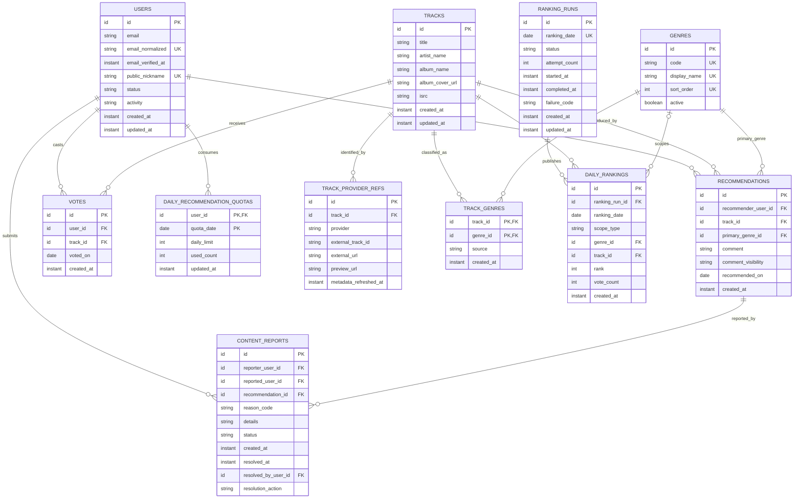

# TrackDrop ERD 및 데이터 무결성 설계

> 상태: **Accepted**
>
> 제품 정책 기준: [`../00-project-baseline.md`](../00-project-baseline.md)
>
> 화면 기준: [`../product/user-flows.md`](../product/user-flows.md)
>
> 기원: Phase 3 설계 문서를 구현용 living document로 전환
>
> 작성일: 2026-08-30
>
> 확정일: 2026-08-30

## 1. 문서 목적

승인된 TrackDrop MVP 정책을 관계형 데이터 모델로 구체화한다. 이 문서는 Entity 관계뿐 아니라 중복 Vote, 일일 4회 제한, Track 정규화, `ROW_NUMBER` snapshot, 신고 기능의 데이터 무결성을 어떤 제약과 트랜잭션으로 보장할지 정의한다.

Phase 5에서 기술 스택과 DB 제품을 결정하기 전이므로 물리적인 PK 타입, 문자열 길이, DB 전용 문법은 아직 고정하지 않는다. 모든 `id`는 외부에서 추측 가능한 연속 번호를 그대로 노출하지 않는 opaque identifier로 취급한다.

## 2. 이 문서가 결정하는 사항

1. User의 로그인 정보와 공개 Identity를 어떻게 분리할지
2. Track과 외부 음악 provider 식별자를 어떻게 분리할지
3. Track의 복수 장르와 Recommendation의 대표 장르를 어떻게 연결할지
4. Recommendation과 Vote 중 어느 Entity가 랭킹 집계의 원장이 될지
5. 사용자당 하루 4회를 동시 요청에서도 어떻게 보장할지
6. 동일 득표수의 Track 이름 정렬과 Top 20 더 보기를 snapshot에 어떻게 보존할지
7. 실패한 Ranking batch가 부분 데이터를 노출하지 않게 할지
8. 숨겨진 신고 기능을 어느 Entity에 연결할지

## 3. 추천 설계 요약

| 주제 | 설계 결정 |
| --- | --- |
| 계정 | Supabase Auth UUID를 `users.id`로 사용하고 TrackDrop DB에는 이메일, 확인 시각과 공개 닉네임만 저장한다. 비밀번호는 저장하지 않는다. |
| Track | 내부 `tracks`와 provider별 `track_provider_refs`를 분리한다. 외부 ID는 Track의 PK가 아니다. |
| Artist | MVP에서는 별도 Entity를 만들지 않고 Track의 `artist_name` 표시 문자열로 저장한다. |
| Genre | Track은 `track_genres`를 통해 여러 장르를 가질 수 있다. Recommendation의 대표 장르는 Apple Music 분류를 활성 시스템 장르에 자동 매칭한다. |
| Recommendation | Track의 날짜별 소개 회차다. 같은 곡은 마지막 회차에서 3일 후 다시 추천할 수 있으며 한줄평을 숨겨도 Track과 Vote 이력은 유지한다. |
| Vote | 랭킹의 유일한 원장이다. User, Track, 서비스 날짜를 저장하고 같은 날짜의 동일 Track 중복 Vote를 DB에서 막는다. |
| 일일 한도 | `daily_recommendation_quotas`의 사용자·날짜 행을 조건부 원자 업데이트해 4회를 넘지 못하게 한다. |
| Ranking | `daily_rankings.rank`에 Vote 수와 Track 이름을 기준으로 계산한 고유 `ROW_NUMBER`를 저장한다. |
| Batch | 날짜별 `ranking_runs` 상태가 `COMPLETED`일 때만 snapshot을 공개한다. |
| 신고 | `content_reports`는 Recommendation의 한줄평과 작성자를 함께 참조한다. 동일 사용자 중복 신고를 막고 미처리 신고 3건에 도달하면 작성자를 `FLAGGED`로 전환한다. |

## 4. 선택 이유와 Trade-off

### 4.1 Vote는 Track만 참조한다

Recommendation은 Track의 추천 회차이며 Vote는 Track을 참조한다. 차트 집계는 해당 서비스 날짜까지 생성된 최신 Recommendation의 대표 장르를 사용하므로 Vote에 `recommendation_id`, `genre_id`, `track_id`를 모두 중복 저장하지 않는다.

장점:

- `UNIQUE(user_id, voted_on, track_id)`로 중복 Vote를 직접 보장한다.
- Vote의 저장 구조가 작고 집계 기준이 명확하다.
- 재추천 회차가 생겨도 Vote의 저장 구조가 바뀌지 않는다.

Trade-off:

- 장르 집계 시 Recommendation을 join해야 한다.
- 대표 장르 변경 기능을 나중에 추가하면 진행 중인 오늘 차트의 장르 집계 의미가 바뀔 수 있다.

MVP 등록 API는 Apple Music 장르를 활성 Genre에 자동 매칭한다. 재추천 시 provider metadata와 장르를 갱신하되 완료된 과거 snapshot은 변경하지 않는다.

### 4.2 일일 한도는 Vote COUNT로만 검사하지 않는다

`COUNT(votes) < 4`를 읽은 뒤 INSERT하는 방식은 동시 요청 두 개가 같은 count를 보고 모두 성공할 수 있다. 사용자·날짜별 quota 행의 `used_count`를 `used_count < daily_limit` 조건으로 원자 증가시키면 DB row lock 아래에서 요청이 직렬화된다.

quota는 정확성 제어용 중복 데이터다. 모든 성공한 Recommendation은 최초 Vote를 하나 만들기 때문에 다음 불변식이 성립한다.

`daily_recommendation_quotas.used_count = 해당 User와 날짜의 Vote 수`

불일치가 생기면 Vote 원장을 기준으로 quota를 복구할 수 있다.

### 4.3 Ranking은 ROW_NUMBER 하나로 저장한다

모든 곡은 고유 순위를 가진다. `ROW_NUMBER`의 정렬 기준을 다음 순서로 고정한다.

1. Vote 수 내림차순
2. Track 이름 오름차순(대소문자 비구분)
3. 아티스트명 오름차순(동명곡 보조 기준)
4. Track ID 오름차순(최종 결정 기준)

`rank` 자체가 1부터 시작하는 고유 표시 순서이므로 화면 표시와 Top 20 pagination에 함께 사용한다. 다국어 Track 이름의 정확한 collation은 DB 선택 단계에서 고정한다.

### 4.4 Recommendation은 삭제하지 않고 한줄평만 숨긴다

각 Recommendation 회차는 과거 차트와 신고의 근거이므로 삭제하지 않는다. `comment_visibility`로 한줄평 노출만 제어하고 Track, Vote, Ranking 이력은 유지한다.

### 4.5 ISRC는 고유키로 강제하지 않는다

ISRC는 provider 간 동일 음원 연결에 유용하지만 누락되거나 잘못 제공될 수 있고, 리마스터·지역판·라이브 버전 구분에도 주의가 필요하다. 따라서 `tracks.isrc`는 검색 가능한 식별 힌트로 저장하되 전역 Unique Constraint를 적용하지 않는다.

MVP의 강한 중복 방지 기준은 `UNIQUE(provider, external_track_id)`다.

## 5. 논리 ERD



## 6. Table 명세

### 6.1 users

| 컬럼 | 필수 | 제약/정책 |
| --- | --- | --- |
| `id` | Y | PK, Supabase Auth user UUID |
| `email` | Y | 로그인·복구 이메일, 공개 금지 |
| `email_normalized` | Y | 소문자화 및 앞뒤 공백 제거, Unique |
| `email_verified_at` | Y | Supabase 이메일 확인 완료 시각 |
| `public_nickname` | Y | 자동 생성 공개 닉네임, Unique |
| `status` | Y | `ACTIVE`, `SUSPENDED`, `WITHDRAWN` 후보 |
| `activity` | Y | 신고 검토 상태 `NORMAL`, `FLAGGED`, `BAN` |
| `created_at` | Y | UTC instant |
| `updated_at` | Y | UTC instant |

주요 제약:

- `UNIQUE(email_normalized)`
- `UNIQUE(public_nickname)`
- 공개 User 응답에는 `public_nickname`만 포함한다.
- 본인 계정 응답에서만 로그인 이메일을 포함한다.

비밀번호는 8~16자이며 공백 없이 영문자와 숫자를 각각 하나 이상 포함하고 특수문자는 선택이다. 이메일 확인 token, 비밀번호 hash와 복구 token은 Supabase Auth의 `auth` schema에서 관리하므로 TrackDrop ERD에 중복 정의하지 않는다.

### 6.2 genres

| 컬럼 | 필수 | 제약/정책 |
| --- | --- | --- |
| `id` | Y | PK |
| `code` | Y | API와 내부에서 사용하는 안정적인 slug, Unique |
| `display_name` | Y | 화면 표시명, Unique |
| `sort_order` | Y | 전역 표시 순서, Unique |
| `active` | Y | 신규 Recommendation에서 선택 가능한지 여부 |

초기 seed:

| sort_order | code | display_name |
| ---: | --- | --- |
| 10 | `alternative` | Alternative |
| 20 | `blues` | Blues |
| 30 | `childrens-music` | Children's Music |
| 40 | `christian-gospel` | Christian & Gospel |
| 50 | `classical` | Classical |
| 60 | `comedy` | Comedy |
| 70 | `country` | Country |
| 80 | `dance` | Dance |
| 90 | `electronic` | Electronic |
| 100 | `fitness-workout` | Fitness & Workout |
| 110 | `hip-hop-rap` | Hip-Hop/Rap |
| 120 | `jazz` | Jazz |
| 130 | `k-pop` | K-Pop |
| 140 | `j-pop` | J-Pop |
| 150 | `latino` | Latino |
| 160 | `metal` | Metal |
| 170 | `pop` | Pop |
| 180 | `rnb-soul` | R&B/Soul |
| 190 | `reggae` | Reggae |
| 200 | `rock` | Rock |
| 210 | `singer-songwriter` | Singer/Songwriter |
| 220 | `soundtrack` | Soundtrack |
| 230 | `world` | World |
| 240 | `other` | Other |

`ALL`은 Genre가 아니라 조회 scope이므로 테이블에 저장하지 않는다. 목록은 Apple Music 최상위 카탈로그 장르를 기준으로 하며 KR용 `J-Pop`과 분류 예외용 `Other`를 포함한다. `sort_order`는 중간 장르 삽입을 고려해 10 단위로 둔다.

### 6.3 tracks

| 컬럼 | 필수 | 제약/정책 |
| --- | --- | --- |
| `id` | Y | 내부 Track PK |
| `title` | Y | provider에서 확정한 곡명 |
| `artist_name` | Y | 여러 아티스트를 포함할 수 있는 표시 문자열 |
| `album_name` | N | 앨범 정보가 없는 provider 응답 허용 |
| `album_cover_url` | N | 외부 이미지 URL |
| `isrc` | N | provider 간 연결 힌트, Unique 아님 |
| `explicit` | Y | provider의 Explicit 표시 |
| `provider_genre_name` | N | Apple이 최종 검증 시 반환한 원본 대표 장르명 |
| `created_at` | Y | 내부 Track 최초 저장 시각 |
| `updated_at` | Y | 메타데이터 갱신 시각 |

Track 메타데이터는 검색 결과를 선택한 시점이 아니라 Recommendation 제출을 확정할 때 저장한다. 제목과 아티스트 문자열만으로 중복 Track을 판정하지 않는다.

### 6.4 track_provider_refs

| 컬럼 | 필수 | 제약/정책 |
| --- | --- | --- |
| `id` | Y | PK |
| `track_id` | Y | FK -> tracks |
| `provider` | Y | MVP는 `APPLE_MUSIC`; 다른 provider 값은 실제 연동 시 migration으로 추가 |
| `external_track_id` | Y | provider가 발급한 Track ID |
| `external_url` | N | 전체 듣기 또는 provider 상세 URL |
| `preview_url` | N | Apple이 공식 제공한 원본 URL만 저장. 다운로드·변환·재호스팅 금지 |
| `metadata_refreshed_at` | Y | 외부 메타데이터 최종 확인 시각 |

주요 제약:

- `UNIQUE(provider, external_track_id)`
- `UNIQUE(track_id, provider)`

두 번째 제약은 MVP에서 한 내부 Track이 provider별 참조 하나만 가진다는 결정이다. 국가별 catalog ID를 여러 개 연결해야 하는 요구가 확인되면 provider market 컬럼을 추가해 확장한다.

MVP의 preview는 Apple이 선택한 공식 30초 구간이다. 시작 위치가 0초라는 정보는 제공되거나 보장되지 않으므로 별도 `preview_start` 값을 추정해 저장하지 않는다. YouTube video ID나 embed URL은 Track 재생 모델에 저장하지 않는다.

`provider=APPLE_MUSIC`은 내부 카탈로그 공급자 식별자이고, MVP의 실제 adapter는 Apple iTunes Search API다. 향후 Apple Music API로 adapter를 교체하더라도 동일한 Apple Track으로 검증되는 참조는 내부 Track PK와 분리해 migration할 수 있어야 한다.

### 6.5 track_genres

| 컬럼 | 필수 | 제약/정책 |
| --- | --- | --- |
| `track_id` | Y | PK 일부, FK -> tracks |
| `genre_id` | Y | PK 일부, FK -> genres |
| `source` | Y | `USER_SELECTED`, `PROVIDER`, `CURATED` 후보 |
| `created_at` | Y | UTC instant |

주요 제약:

- `PRIMARY KEY(track_id, genre_id)`
- Recommendation 생성 시 Apple Music의 원본 Genre를 시스템 Genre와 매칭하고 `PROVIDER` source로 관계를 생성한다.
- 일치하는 활성 시스템 Genre가 없으면 `Other`를 사용하며, 사용자는 대표 Genre를 선택하지 않는다.

### 6.6 recommendations

| 컬럼 | 필수 | 제약/정책 |
| --- | --- | --- |
| `id` | Y | PK |
| `recommender_user_id` | Y | FK -> users |
| `track_id` | Y | FK -> tracks |
| `primary_genre_id` | Y | FK -> genres |
| `comment` | Y | trim 후 1~120자 |
| `comment_visibility` | Y | `VISIBLE`, `HIDDEN` |
| `recommended_on` | Y | 추천 회차의 `Asia/Seoul` 서비스 날짜 |
| `created_at` | Y | 추천 회차 생성 시각, 수정하지 않음 |

주요 제약:

- `UNIQUE(track_id, recommended_on)`: 한 곡은 같은 서비스 날짜에 한 추천 회차만 생성
- 마지막 `recommended_on + 3일`부터 새 Recommendation을 만들 수 있으며 Track 행은 재사용한다.
- `(track_id, primary_genre_id)`는 `track_genres(track_id, genre_id)`를 참조하는 복합 FK
- `CHECK(comment length between 1 and 120)`에 해당하는 DB 검증
- 등록 시 provider 원본 분류를 `genres.active = true`인 시스템 장르에 자동 매칭하며 사용자 입력은 받지 않는다.
- 대표 Genre 수정 endpoint는 MVP에 포함하지 않는다. ERD 자체는 향후 통제된 변경 가능성을 막지 않는다.
- 한줄평이 숨겨져도 Recommendation과 Track은 삭제하지 않는다.

### 6.7 votes

| 컬럼 | 필수 | 제약/정책 |
| --- | --- | --- |
| `id` | Y | PK |
| `user_id` | Y | FK -> users |
| `track_id` | Y | FK -> tracks |
| `voted_on` | Y | `Asia/Seoul` 기준 서비스 날짜 |
| `created_at` | Y | 실제 생성 UTC instant |

주요 제약:

- `UNIQUE(user_id, voted_on, track_id)`
- `voted_on`은 요청 body에서 받지 않고 서버 clock으로 결정한다.
- 신규 Recommendation의 최초 추천도 동일한 Vote 행 하나로 표현한다.
- Vote 취소와 hard delete는 MVP에서 허용하지 않는다.

랭킹의 최종 원장은 Vote 행이다. 별도 `tracks.vote_count` 누적 컬럼을 두지 않는다.

### 6.8 daily_recommendation_quotas

| 컬럼 | 필수 | 제약/정책 |
| --- | --- | --- |
| `user_id` | Y | PK 일부, FK -> users |
| `quota_date` | Y | PK 일부, `Asia/Seoul` 서비스 날짜 |
| `daily_limit` | Y | 현재 정책은 4, 해당 날짜 정책 snapshot |
| `used_count` | Y | 성공한 Recommendation/Vote 횟수 |
| `updated_at` | Y | 마지막 사용 시각 |

주요 제약:

- `PRIMARY KEY(user_id, quota_date)`
- `CHECK(daily_limit = 4)`는 정책이 코드 설정으로 유지되는 동안 애플리케이션에서 보장한다. DB에는 `daily_limit > 0`을 적용한다.
- `CHECK(used_count >= 0 AND used_count <= daily_limit)`
- 자정에 행을 초기화하지 않는다. 새 날짜에 새 행을 생성한다.
- 일반 조회 화면에서는 `used_count/4`를 `오늘의 추천 n/4`로 표시한다.

### 6.9 ranking_runs

| 컬럼 | 필수 | 제약/정책 |
| --- | --- | --- |
| `id` | Y | PK |
| `ranking_date` | Y | 확정 대상 서비스 날짜, Unique |
| `status` | Y | `PENDING`, `RUNNING`, `COMPLETED`, `FAILED` |
| `attempt_count` | Y | 실행 시도 횟수 |
| `started_at` | N | 최근 실행 시작 시각 |
| `completed_at` | N | 성공 완료 시각 |
| `failure_code` | N | 비밀정보가 없는 분류 코드 |
| `created_at` | Y | UTC instant |
| `updated_at` | Y | UTC instant |

주요 제약:

- `UNIQUE(ranking_date)`
- `UNIQUE(id, ranking_date)`: DailyRanking의 실행 날짜 일치 검증용
- `attempt_count >= 0`
- 과거 차트 API는 `COMPLETED` run에 연결된 snapshot만 반환한다.
- 이미 `COMPLETED`인 날짜의 일반 재실행 요청은 no-op으로 처리한다.

### 6.10 daily_rankings

| 컬럼 | 필수 | 제약/정책 |
| --- | --- | --- |
| `id` | Y | PK |
| `ranking_run_id` | Y | FK -> ranking_runs |
| `ranking_date` | Y | 조회와 제약을 위한 대상 날짜 복제 |
| `scope_type` | Y | `ALL` 또는 `GENRE` |
| `genre_id` | 조건부 | `GENRE`일 때 FK -> genres, `ALL`일 때 null |
| `track_id` | Y | FK -> tracks |
| `rank` | Y | Vote 수와 Track 이름 tie-break 기준 `ROW_NUMBER` 결과 |
| `vote_count` | Y | 확정 득표 수 |
| `created_at` | Y | snapshot 생성 시각 |

논리 제약:

- `(ranking_run_id, ranking_date)`는 `ranking_runs(id, ranking_date)`를 참조하는 복합 FK
- `scope_type = ALL`이면 `genre_id IS NULL`
- `scope_type = GENRE`이면 `genre_id IS NOT NULL`
- 전체: `UNIQUE(ranking_date, track_id) WHERE scope_type = ALL`
- 장르: `UNIQUE(ranking_date, genre_id, track_id) WHERE scope_type = GENRE`
- 전체 순위: `UNIQUE(ranking_date, rank) WHERE scope_type = ALL`
- 장르 순위: `UNIQUE(ranking_date, genre_id, rank) WHERE scope_type = GENRE`
- `rank > 0`, `vote_count > 0`

조건부 Unique 구현 방법은 선택한 DB에 따라 partial unique index, generated scope key, 별도 테이블 분리 중 하나를 Phase 5에서 확정한다.

순위 계산:

```sql
ROW_NUMBER() OVER (
  ORDER BY
    vote_count DESC,
    normalized_track_title ASC,
    normalized_artist_name ASC,
    track_id ASC
) AS rank
```

`normalized_track_title`과 `normalized_artist_name`은 정렬 표현을 나타낸다. 실제 구현은 선택한 DB의 case-insensitive Unicode collation 또는 동등한 정규화 expression을 사용한다. `rank`는 화면 표시와 Top 20 더 보기 경계에 함께 사용한다.

### 6.11 content_reports

| 컬럼 | 필수 | 제약/정책 |
| --- | --- | --- |
| `id` | Y | PK |
| `reporter_user_id` | Y | FK -> users |
| `reported_user_id` | Y | 한줄평 작성자 FK -> users |
| `recommendation_id` | Y | FK -> recommendations |
| `reason_code` | Y | 사전 정의된 신고 사유 |
| `details` | N | 추가 설명, 최대 길이는 API 단계에서 결정 |
| `status` | Y | `PENDING`, `REVIEWED`, `DISMISSED`, `ACTIONED` 후보 |
| `created_at` | Y | UTC instant |
| `resolved_at` | N | 처리 완료 시각 |
| `resolved_by_user_id` | N | 조치한 관리자 FK -> users, 관리자 탈퇴 시 null |
| `resolution_action` | N | `DISMISS`, `BAN` |

주요 제약:

- `UNIQUE(reporter_user_id, recommendation_id)`
- 자기 Recommendation과 차단된 사용자의 Recommendation은 신고할 수 없다.
- 작성자의 미처리 신고가 기본 3건에 도달하면 `users.activity`를 `FLAGGED`로 전환한다.
- 신고가 생성됐다는 사실만으로 한줄평을 자동 숨기지 않는다.
- 관리자 무혐의 조치는 대기 신고를 `DISMISSED`로 종결하고 사용자를 `NORMAL`로 되돌린다.
- 관리자 이용 제한은 대기 신고를 `ACTIONED`로 종결하고 사용자를 `BAN`·`SUSPENDED`로 전환하며 한줄평과 기존 세션을 회수한다.

## 7. 핵심 인덱스

PK와 Unique Constraint가 만드는 인덱스 외에 다음 인덱스를 권장한다.

| 인덱스 대상 | 목적 |
| --- | --- |
| `votes(voted_on, track_id)` | 오늘 전체 집계와 Ranking batch |
| `votes(user_id, voted_on)` | 사용자별 오늘 Vote 상태 및 quota 감사 |
| `recommendations(primary_genre_id, track_id)` | 장르별 Vote 집계 join |
| `recommendations(created_at DESC, id DESC)` | 홈과 최근 등록 목록 |
| `recommendations(track_id, recommended_on DESC, created_at DESC)` | 최신 회차와 3일 재추천 가능일 조회 |
| `tracks(isrc)` | ISRC 후보 검색. null과 중복 허용 |
| `daily_rankings(ranking_date, scope_type, genre_id, rank)` | 과거 Top 50의 20곡 + 30곡 더 보기 |
| `content_reports(status, created_at)` | 향후 운영 검토 queue |
| `content_reports(reported_user_id, status, created_at DESC)` | 사용자별 미처리 신고 집계와 관리자 검토 목록 |

오늘 추천 상위 홈은 `votes(voted_on, track_id)` 집계를 사용한다. 초기에는 별도 counter나 Redis 없이 시작하고, 실제 조회 부하가 확인되면 cache를 추가한다.

## 8. 트랜잭션과 동시성

### 8.1 quota 소비 공통 로직

Recommendation 생성과 기존 Track Vote는 동일한 quota 소비 함수를 사용한다.

개념적 순서:

1. `(user_id, quota_date)` quota 행이 없으면 `daily_limit=4`, `used_count=0`으로 생성 시도한다.
2. 다음 조건부 update를 실행한다.

```sql
UPDATE daily_recommendation_quotas
SET used_count = used_count + 1,
    updated_at = :now
WHERE user_id = :userId
  AND quota_date = :today
  AND used_count < daily_limit;
```

3. 영향받은 행이 1개가 아니면 `DAILY_LIMIT_EXCEEDED`로 실패한다.
4. 이후 도메인 INSERT가 실패하면 같은 트랜잭션의 quota 증가도 rollback한다.

동일 User/date의 동시 요청은 quota 행 lock에서 직렬화되므로 최대 4개만 성공한다.

### 8.2 기존 Track Vote

하나의 DB 트랜잭션에서 다음을 수행한다.

1. 인증 User와 활성 Track/Recommendation을 확인한다.
2. quota 1회를 원자적으로 소비한다.
3. `votes(user_id, track_id, voted_on)`을 INSERT한다.
4. commit한다.

동일 Track 중복 Vote라면 Unique Constraint가 INSERT를 거부하고 트랜잭션 전체가 rollback되므로 quota도 소비되지 않는다. 사전 중복 조회는 친절한 오류 메시지를 위해 사용할 수 있지만 정확성의 근거는 아니다.

### 8.3 Recommendation 회차와 최초 Vote

외부 music API 검색과 선택은 DB 트랜잭션 밖에서 수행한다. 최종 제출 시 provider 식별자로 메타데이터를 재검증한 뒤 하나의 DB 트랜잭션에서 다음을 수행한다.

1. `(provider, external_track_id)`로 기존 provider 참조와 Track을 조회하고 Track 행을 잠근다.
2. Track이 없으면 Track과 provider 참조를 생성한다.
3. 기존 Track이면 최신 `recommended_on`과 오늘 Vote를 확인한다.
4. 마지막 등록일에서 3일이 지나지 않았으면 `RECOMMENDATION_COOLDOWN`, 오늘 차트에 이미 있으면 `ALREADY_IN_CURRENT_CHART`로 실패한다.
5. quota 1회를 원자적으로 소비하고 `track_genres` 관계를 보완한다.
6. 새 Recommendation 회차와 추천자의 최초 Vote를 생성한다.
7. commit한다.

Track 행 lock과 `UNIQUE(track_id, recommended_on)`이 동시 재등록을 직렬화한다. 충돌한 요청의 quota와 임시 변경은 모두 rollback한다.

### 8.4 삭제와 수정 정책

- User는 상태 전환을 사용하며 일반 기능에서 hard delete하지 않는다.
- Track과 Recommendation은 Vote 또는 Ranking에서 참조된 이후 hard delete하지 않는다.
- 대표 Genre는 등록 시 provider 원본 분류로 자동 결정한다. MVP에는 일반 수정 endpoint를 제공하지 않는다.
- 한줄평은 일반 사용자가 수정·삭제할 수 없다.
- 운영 숨김은 `comment_visibility=HIDDEN`으로 처리한다.
- Vote는 취소·수정·삭제하지 않는다.
- 완료된 DailyRanking은 일반 요청으로 수정하지 않는다.

## 9. Daily Ranking batch

### 9.1 대상과 계산

매일 00:00 `Asia/Seoul` 이후 전날 `voted_on`을 대상으로 실행한다.

1. 대상 날짜의 `ranking_runs`를 생성하거나 기존 실패 run을 `RUNNING`으로 전환한다.
2. `votes.voted_on = targetDate`를 Track별로 집계한다.
3. 전체 scope의 `vote_count`와 `ROW_NUMBER` 기반 `rank`를 계산한다.
4. 대상 날짜까지 생성된 가장 최근 Recommendation의 `primary_genre_id`로 장르별 집계를 계산한다.
5. 대상 날짜의 미완료 snapshot을 교체하고 새 `daily_rankings`를 저장한다.
6. 같은 트랜잭션에서 run을 `COMPLETED`로 전환한다.

득표가 0인 Track은 snapshot에 저장하지 않는다.

### 9.2 부분 실패 방지

run 상태 전환은 다음 경계를 사용한다.

1. 짧은 트랜잭션으로 `RUNNING`과 `attempt_count`를 기록한다.
2. 별도 집계 트랜잭션에서 기존 미완료 rows 제거, 전체/장르 snapshot INSERT, `COMPLETED` 전환을 함께 수행한다.
3. 집계 트랜잭션이 실패하면 모든 snapshot 변경이 rollback된다.
4. 외부 오류 처리에서 run만 `FAILED`로 전환하고 `failure_code`를 기록한다.

과거 차트 조회는 run이 `COMPLETED`인 경우에만 rows를 반환하므로 부분 snapshot이 사용자에게 노출되지 않는다.

### 9.3 idempotency와 재실행

- 같은 날짜에 `COMPLETED` run이 있으면 일반 실행은 no-op이다.
- `FAILED` run은 같은 run row의 `attempt_count`를 증가시켜 재실행한다.
- 재실행은 해당 run의 snapshot rows를 트랜잭션 안에서 교체한다.
- 운영상 강제 재집계는 별도 권한이 있는 명령으로만 허용하고 감사 로그를 남긴다.

## 10. 홈 조회 모델

홈은 별도 Entity를 만들지 않고 원장 데이터에서 두 projection을 조회한다.

### 오늘 가장 많은 추천을 받는 노래

- `votes.voted_on = today`를 Track별 집계
- `vote_count DESC, track.title ASC, track.artist_name ASC, track_id ASC` 정렬
- 홈에서는 순위 번호보다 곡과 Vote 수를 강조
- 전체보기는 오늘 전체 Daily Chart로 이동

### 최근 등록된 노래

- KST 현재 날짜에 생성된 Recommendation만 조회
- `recommendations.created_at DESC, recommendation.id DESC` 정렬
- 순위 번호 없음
- 전체보기는 최근 등록 목록으로 이동

별도 home feed 테이블이나 사전 계산 counter는 MVP에 추가하지 않는다.

## 11. Referential Action 정책

| 관계 | 삭제 정책 | 이유 |
| --- | --- | --- |
| User -> Recommendation/Vote/Report | `RESTRICT` 또는 User soft state | 이력과 Ranking 원장 보존 |
| Track -> Recommendation/Vote/Ranking | `RESTRICT` | 추천 및 snapshot 재현 |
| Track -> ProviderRef/TrackGenre | Track 삭제를 운영 migration으로 제한 | 자동 cascade 오삭제 방지 |
| Genre -> TrackGenre/Recommendation/Ranking | `RESTRICT`, 비활성화 사용 | 과거 장르 차트 보존 |
| Recommendation -> ContentReport | `RESTRICT` | 신고 이력 보존 |
| RankingRun -> DailyRanking | 일반 기능에서 삭제 금지 | snapshot 원자성 및 감사 |

MVP 도메인 Entity에는 자동 `ON DELETE CASCADE`를 기본값으로 사용하지 않는다. 테스트 fixture나 미완료 batch 정리처럼 명확히 범위가 제한된 운영 작업에서만 명시적으로 삭제한다.

## 12. 주요 불변식

1. Supabase Auth UUID, 정규화 이메일과 공개 닉네임은 각각 고유하다.
2. 공개 응답은 이메일을 노출하지 않는다.
3. provider와 external Track ID 조합은 고유하다.
4. Track은 여러 날짜의 Recommendation 회차를 가질 수 있지만 같은 날짜에는 하나만 가진다.
5. 곡의 Recommendation 회차는 직전 회차 날짜에서 3일이 지난 날부터 만들 수 있다.
6. Recommendation의 대표 Genre는 해당 Track의 TrackGenre에 존재한다.
7. 한 User는 같은 서비스 날짜에 같은 Track에 한 번만 Vote한다.
8. 한 User의 성공 Vote는 서비스 날짜당 최대 4개다.
9. Recommendation 생성은 해당 회차의 최초 Vote를 반드시 동반한다.
10. quota 소비와 Vote 생성은 같은 트랜잭션에서 성공하거나 실패한다.
11. 한줄평 숨김은 Track, Vote, Ranking을 삭제하지 않는다.
12. 동일 User는 동일 Recommendation을 한 번만 신고한다.
13. rank는 Vote 수 내림차순과 Track 이름 오름차순을 포함한 결정적 기준으로 `ROW_NUMBER`를 계산한다.
14. 완료된 날짜의 DailyRanking은 읽기 전용이다.
15. `COMPLETED` RankingRun에 연결된 snapshot만 사용자에게 노출한다.

## 13. ERD에서 제외한 항목

- 별도 Artist Entity
- 사용자 Taste Profile과 통계
- 댓글과 팔로우
- Playlist
- Supabase Auth가 관리하는 이메일 인증 token 및 비밀번호 재설정 token
- 관리자 계정과 역할/권한 테이블
- Redis cache 자료구조
- Rising, Hidden Gems, Weekly/Monthly Ranking
- 외부 API 원본 응답 저장 테이블
- Track 누적 vote_count 컬럼

이 항목들은 현재 MVP 무결성에 필요하지 않거나 후속 기능의 수명주기에 맞춰 추가하는 편이 안전하다.

## 14. REST API 계약에 미치는 영향

- 회원가입 요청은 `email`, `password`를 받고 이메일 확인 후 최초 로그인 시 공개 닉네임을 생성한다.
- 공개 User 응답과 본인 Account 응답을 분리한다.
- 외부 검색 결과와 내부 Track 응답을 서로 다른 schema로 정의한다.
- Recommendation 생성은 provider 식별자와 한줄평만 받으며 대표 Genre는 서버가 결정한다.
- Vote 생성은 `trackId`만 받고 user와 날짜는 서버가 결정한다.
- quota 응답은 `limit=4`, `used`, `remaining`, `resetAt`을 제공한다.
- 오늘 차트는 live projection, 과거 차트는 completed snapshot만 반환한다.
- 과거 차트 route에는 Vote 명령을 연결하지 않는다.
- 과거 차트의 더 보기는 고유 `rank`에 대응하는 안정적인 cursor 계약을 사용한다.
- 동시 Track 등록은 500 오류가 아니라 `RECOMMENDATION_COOLDOWN` 또는 `ALREADY_IN_CURRENT_CHART` 도메인 결과로 반환한다.
- 신고 endpoint는 feature flag가 꺼지면 비활성 응답을 반환한다.

## 15. 데이터 모델 결정

승인된 정책:

1. 같은 곡은 마지막 추천 회차의 KST 날짜에서 3일이 지난 날부터 다시 등록할 수 있다.
2. 대표 장르는 Apple Music 분류를 시스템 장르에 자동 매칭하며 사용자가 선택하지 않는다.
3. Vote 취소를 MVP에서 제공하지 않는다.
4. Supabase Auth UUID와 이메일을 각각 계정당 Unique로 제한한다.
5. 한줄평 신고 대상을 Recommendation으로 한정한다.
6. Ranking은 `ROW_NUMBER`를 사용하고 동일 득표 수는 Track 이름 오름차순으로 정렬한다.

대표 Genre의 일반 수정 기능은 승인된 MVP에 포함하지 않았지만 DB 수준의 영구 불변 제약으로 고정하지도 않는다. 향후 수정 기능을 검토할 때 진행 중 차트의 재분류 정책을 함께 결정한다.

## 16. 문서 완료 조건

- 모든 MVP 저장 데이터가 Entity와 관계에 배치된다.
- 일일 4회와 중복 Vote가 DB 트랜잭션 및 제약으로 보장된다.
- 외부 Track ID와 내부 Track ID가 분리된다.
- 대표 Genre의 무결성을 복합 FK로 설명할 수 있다.
- `ROW_NUMBER`와 Track 이름 tie-break, Top 20 pagination이 함께 표현된다.
- Ranking batch가 재실행 가능하고 부분 snapshot을 노출하지 않는다.
- 신고 기능을 숨겨도 구현과 테스트가 가능한 모델이 존재한다.
- REST API가 필요한 명령과 조회 projection을 도출할 수 있다.
