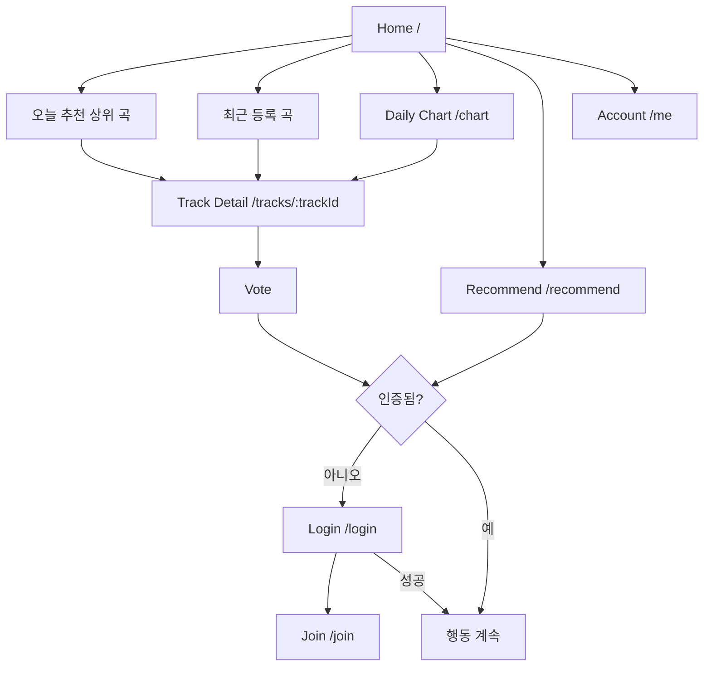
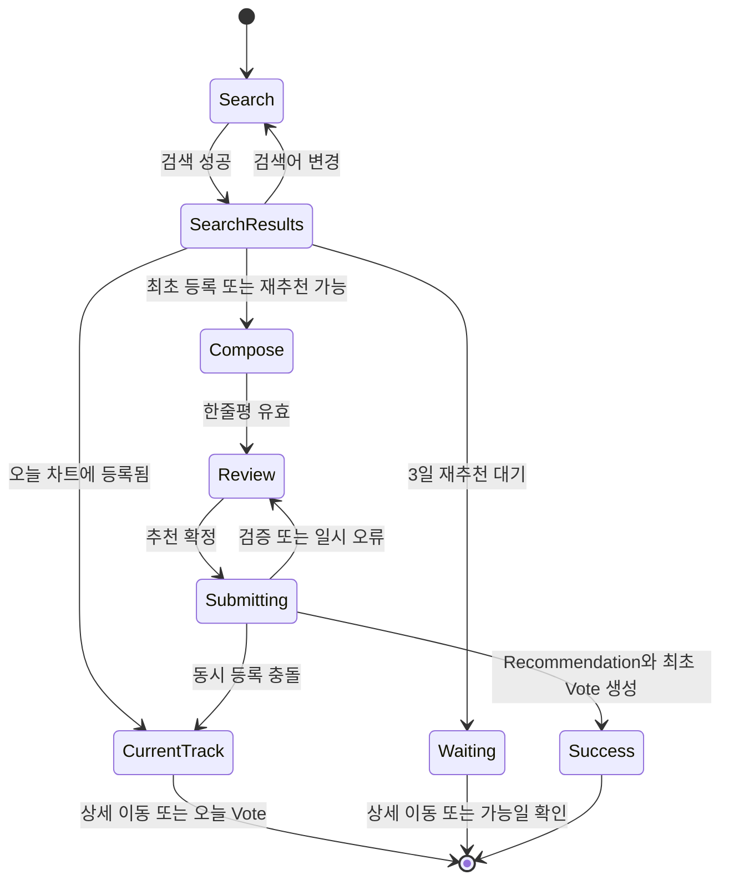

# TrackDrop 화면 및 상세 User Flow

> 상태: **Accepted**
>
> 제품 정책 기준: [`../00-project-baseline.md`](../00-project-baseline.md)
>
> 기원: Phase 2 설계 문서를 구현용 living document로 전환
>
> 확정일: 2026-08-30
>
> 서비스명: **TrackDrop**

## 1. 문서 목적

승인된 MVP 정책을 사용자가 실제로 경험할 화면과 상호작용으로 변환한다. 이 문서는 시각 디자인 시안이 아니라 정보 구조, 화면별 책임, 이동 규칙, 상태와 오류 복구 방식을 정의한다.

구현 전에 이 문서를 확정하면 이후 ERD와 REST API가 실제 화면에 필요한 데이터와 행동을 빠뜨리지 않게 된다.

## 2. 이 문서가 결정하는 사항

1. 첫 화면과 전역 내비게이션의 구조
2. 비회원이 사용할 수 있는 범위와 로그인 유도 시점
3. 오늘 차트와 과거 차트를 한 화면에서 어떻게 구분할지
4. 신규 추천의 검색, 선택, 작성, 확정 단계를 어떻게 나눌지
5. 차트에서 투표와 미리듣기를 얼마나 빠르게 수행할 수 있게 할지
6. 일일 권한, 중복 투표, 외부 API 장애를 어떤 상태로 보여줄지
7. 모바일과 데스크톱에서 같은 흐름을 어떻게 유지할지

## 3. 추천 설계

### 3.1 UX 원칙

1. **발견 우선 홈**: 첫 화면에서 오늘 가장 추천받는 곡과 최근 등록된 곡을 바로 탐색한다. 별도의 마케팅 랜딩 페이지는 두지 않는다.
2. **읽기는 공개, 쓰기는 인증**: 비회원도 차트 조회, 상세 확인, preview, 외부 링크를 사용할 수 있다. 투표와 신규 추천만 로그인이 필요하다.
3. **한 화면, 한 핵심 행동**: 차트에서는 탐색과 투표, 추천 화면에서는 검색과 등록에 집중한다.
4. **권한을 항상 예측 가능하게**: 로그인 사용자는 남은 일일 권한을 투표·추천 전에 확인할 수 있다.
5. **실패 후 맥락 보존**: 로그인이나 재시도가 필요해도 선택한 곡, 장르, 검색어, 돌아갈 위치를 가능한 한 유지한다.
6. **Preview는 선택 기능**: Apple 공식 30초 preview가 없어도 곡 카드와 추천 흐름은 완전하게 작동한다. preview는 provider가 선택한 구간이며 인트로로 표기하지 않는다.
7. **오늘과 기록을 혼동하지 않게**: 오늘은 실시간 기준 시각을 표시하고, 종료된 날짜는 선택 날짜와 읽기 전용 행동으로 구분한다.

### 3.2 정보 구조

### 3.3 전역 내비게이션

데스크톱 헤더:

- 워드마크 `TrackDrop`: 홈으로 이동
- `Home`: 오늘 추천 상위 곡과 최근 등록 곡
- `Daily Chart`: 전체 및 장르별 일간 차트
- `Recommend`: 신규 추천 흐름 시작
- `오늘의 추천 n/4`: 인증 사용자에게만 표시
- 계정 메뉴 또는 `Login`

모바일 하단 내비게이션:

- Home
- Chart
- Recommend
- Me

현재 위치는 아이콘뿐 아니라 레이블과 선택 상태로 함께 표시한다. 모바일 상단에는 현재 화면 제목과 필요한 날짜/장르 컨트롤만 둔다.

장르 카테고리를 표시하는 모든 화면은 `Hip-Hop, R&B, Rock, Indie, Electronic, Jazz, K-Pop, J-Pop, Pop, Other` 순서를 공통으로 사용한다. `ALL`은 장르가 아니라 전체 조회 scope이므로 가장 앞에 둔다.

### 3.4 Route 제안

| Route | 화면 | 접근 | 비고 |
| --- | --- | --- | --- |
| `/` | Home | 공개 | 오늘 추천 상위 곡과 최근 등록 곡을 제공하는 기본 진입점 |
| `/chart?date=YYYY-MM-DD&genre=slug` | 날짜·장르별 차트 | 공개 | 오늘은 live, 과거는 snapshot |
| `/recent` | 오늘 등록 곡 | 공개 | KST 현재 날짜의 Recommendation 생성 시각 내림차순 목록 |
| `/tracks/{trackId}` | Track 상세 | 공개 | preview, 외부 링크, 한줄평, 투표 |
| `/recommend` | 신규 음악 추천 | 인증 | 미인증 시 로그인 후 복귀 |
| `/login` | 로그인 | 공개 | return URL과 pending intent 보존 |
| `/join` | 계정 생성 | 공개 | 이메일, 비밀번호 입력 및 확인 메일 안내 |
| `/me` | 계정 요약 | 인증 | 닉네임, 남은 권한, 로그아웃 |

`/chart`는 날짜와 장르를 URL query로 표현해 새로고침, 공유, 뒤로 가기에서도 같은 차트를 복원한다. 추천 작성 중 임시값은 URL에 노출하지 않고 세션 내 draft로 관리한다.

## 4. 설계 선택 이유

- 홈에서 오늘 주목받는 곡과 새로 소개된 곡을 함께 보여주면 인기와 신선함 중 하나에 치우치지 않고 서비스의 발견 가치를 빠르게 전달한다.
- 공개 탐색은 진입 장벽을 낮추고, 쓰기 시점 인증은 중복 투표와 일일 제한을 지킬 수 있게 한다.
- 전체 순위와 장르 탐색은 Daily Chart에 모으고, 홈은 대표 발견 섹션에 집중해 화면 책임을 분리한다.
- 신규 추천은 외부 검색과 도메인 쓰기가 결합된 복잡한 흐름이므로 차트의 작은 modal보다 독립 페이지가 모바일, 오류 처리, 접근성에 유리하다.
- Track 상세는 차트 목록을 과밀하게 만들지 않으면서 한줄평, 외부 링크, 메타데이터를 충분히 제공한다.
- 로그인 후 자동으로 투표를 실행하지 않고 원래 화면으로 돌아와 한 번 더 명시적으로 누르게 하면 의도하지 않은 권한 소비를 막는다.

## 5. 대안과 Trade-off

| 대안 | 장점 | 단점 및 MVP 판단 |
| --- | --- | --- |
| 가입 전용 첫 화면 | 서비스 설명을 충분히 제공할 수 있다. | 음악 발견까지 한 단계가 늘어난다. 채택하지 않는다. |
| 모든 기능에 로그인 요구 | 권한 처리가 단순하다. | 차트를 보기 전 이탈 가능성이 크다. 읽기는 공개한다. |
| 추천 작성을 modal로 처리 | 현재 차트 맥락을 유지하기 쉽다. | 검색 결과, 오류, 키보드, 모바일 높이 처리가 복잡하다. 독립 페이지를 사용한다. |
| 장르별 별도 Route | 검색 엔진과 공유 링크가 명확하다. | 고정 장르가 늘수록 route 관리가 중복된다. query parameter를 사용한다. |
| 차트 카드에서 모든 정보 표시 | 상세 페이지 이동이 줄어든다. | 모바일 목록 밀도가 낮아지고 반복 탐색이 느려진다. 핵심 정보만 표시한다. |
| 로그인 후 pending Vote 자동 실행 | 클릭 수가 줄어든다. | 로그인 사이에 날짜나 권한 상태가 바뀔 수 있고 의도 확인이 없다. 원래 위치 복귀까지만 자동화한다. |
| 추천 흐름을 여러 Route로 분리 | 각 단계 URL을 공유할 수 있다. | 선택한 외부 검색 결과와 draft 복구가 복잡해진다. 한 Route 안의 단계로 처리한다. |

## 6. 화면 명세

### S-01. Home

목적: 사용자가 별도의 필터 조작 없이 오늘 주목받는 음악과 새로 소개된 음악을 빠르게 발견한다.

섹션:

1. **오늘 가장 많은 추천을 받는 노래**: 오늘 Vote 수 내림차순으로 제공한다. 공동 득표 곡은 홈에서 순위 번호를 강조하지 않고 안정적인 보조 정렬을 사용한다.
2. **최근 등록된 노래**: KST 현재 날짜에 생성된 Recommendation만 생성 시각 내림차순으로 제공하며 자정에 새 날짜 기준으로 초기화한다.

각 섹션은 제한된 개수의 곡을 미리 보여주고 전체보기로 연결한다. 오늘 추천 상위 곡의 전체보기는 오늘 전체 Daily Chart로, 최근 등록 곡의 전체보기는 최근 등록 목록으로 이동한다.

곡 항목에는 앨범 커버, 곡명, 아티스트, 대표 장르, 한줄평, 오늘 Vote 수, preview와 외부 듣기 행동을 제공한다. 오늘의 Track에는 Vote가 가능하며 로그인 사용자에게 `오늘의 추천 n/4`를 함께 표시한다.

상태:

| 상태 | 표시와 행동 |
| --- | --- |
| Loading | 두 섹션의 안정된 크기를 유지하는 skeleton 표시 |
| 일부 Empty | 데이터가 있는 섹션은 유지하고 빈 섹션에 신규 추천 진입점 제공 |
| 전체 Empty | 첫 음악 추천을 유도하고 차트용 빈 상태를 함께 표시 |
| Error | 실패한 섹션만 재시도하며 다른 섹션은 유지 |

### S-02. Daily Chart

목적: 사용자가 오늘 또는 선택한 과거 날짜의 음악을 전체/장르별 순위로 탐색한다.

핵심 콘텐츠:

- 날짜 컨트롤: 이전 날짜, 날짜 선택, 다음 날짜
- 상태 안내: 오늘은 `LIVE` 기준 시각을 표시하고 과거 차트에는 별도 `FINAL` 문구를 노출하지 않는다.
- 장르 탭: ALL, Hip-Hop, R&B, Rock, Indie, Electronic, Jazz, K-Pop, J-Pop, Pop, Other
- 차트 갱신 기준 시각
- 오늘 차트는 추천순 20곡 단위 더 보기, 과거 차트는 Top 50 중 20곡을 먼저 표시한 뒤 나머지 30곡 더 보기
- 로그인 사용자의 남은 일일 권한

오늘 이후 날짜는 선택할 수 없다. 과거 날짜에서 다음 버튼을 누를 때 오늘까지만 이동한다.

곡 행 또는 카드의 정보 우선순위:

1. 순위와 순위 변동 영역
2. 앨범 커버
3. 곡명과 아티스트
4. 대표 장르
5. 최초 추천자의 한줄평과 공개 닉네임
6. Vote 수와 Vote 행동
7. Preview 재생
8. 외부 전체 듣기 메뉴

모든 곡은 `ROW_NUMBER` 기반의 고유한 순위를 가진다. Vote 수가 같으면 Track 이름의 대소문자를 구분하지 않는 오름차순으로 정렬하고, 동명곡은 아티스트명과 Track ID 순으로 고정한다. MVP에는 전일 순위 비교 데이터가 없으므로 순위 변동 값은 표시하지 않는다.

행동:

- 장르 전환
- 날짜 전환
- `30초 미리듣기` 재생/일시정지
- Track 상세 열기
- 오늘 `LIVE` 차트에서 Vote
- 외부 서비스에서 전체 듣기
- 오늘은 다음 20곡, 과거는 남은 30곡 더 보기

과거 차트에서는 저장된 Top 50의 당시 Vote 수와 순위 목록만 조회한다. API 상태는 `FINAL`이지만 화면에는 `DAILY CHART`를 사용한다. Vote와 신규 Recommendation 행동은 노출하지 않으며 과거 snapshot을 변경하거나 오늘의 Vote로 전환하지 않는다. Preview와 외부 듣기는 순위 데이터에 영향을 주지 않는 탐색 행동으로 유지할 수 있다.

상태:

| 상태 | 표시와 행동 |
| --- | --- |
| Loading | 목록의 안정된 크기를 유지하는 skeleton 표시 |
| Empty | 선택 날짜·장르에 확정된 곡이 없음을 알리고 오늘 차트 또는 추천으로 이동 제공 |
| Live | 오늘 날짜와 갱신 시각 표시, Vote 가능 |
| Final | 확정 차트임을 표시하고 Vote/Recommendation 행동을 숨김. snapshot 값은 변하지 않음 |
| Snapshot pending | 확정 처리 중임을 표시하고 실시간 값으로 대체하지 않음 |
| Error | 기존 화면 맥락을 유지하고 재시도 제공 |

반응형 구조:

- 데스크톱: 순위 목록을 조밀한 행 형태로 표시하고 주요 행동을 한 줄에 배치한다.
- 모바일: 앨범 커버와 곡 정보를 위쪽에, 한줄평과 행동을 아래쪽에 배치한다. 장르 탭은 가로 스크롤 가능하되 현재 탭이 보이게 한다.

### S-03. Recent Tracks

목적: 사용자가 커뮤니티에 최근 소개된 곡을 등록 시각 순으로 탐색한다.

구성:

- Recommendation 생성 시각 내림차순 목록
- 최초 20곡과 더 보기
- 앨범 커버, 곡명, 아티스트, 대표 장르, 한줄평, 등록 시각
- 오늘의 Vote 수와 Vote 행동
- Preview와 외부 듣기

최근 등록 목록은 순위가 아니므로 순위 번호를 표시하지 않는다. 동일한 시각의 항목은 Recommendation ID로 순서를 고정하고, 새 Recommendation이 생기더라도 이미 불러온 더 보기 결과가 불필요하게 중복되지 않도록 페이지 기준을 설계한다.

### S-04. Track Detail

목적: 차트보다 넓은 맥락에서 곡을 확인하고 preview, Vote, 외부 듣기를 수행한다.

콘텐츠:

- 앨범 커버, 곡명, 아티스트, 앨범
- 대표 장르와 보조 장르
- 최초 추천자의 공개 닉네임, 한줄평, 추천 시각
- 오늘의 Vote 수와 사용자 Vote 상태
- Apple 공식 30초 preview player 또는 미제공 상태
- Apple이 응답한 외부 Track 링크와 필요한 Store attribution
- 오늘 차트에서의 현재 전체/장르 순위가 있을 때만 표시

행동과 상태:

- 미인증 Vote는 로그인 후 해당 상세 화면으로 돌아온다.
- 이미 오늘 Vote한 곡은 완료 상태와 오늘은 다시 투표할 수 없다는 설명을 표시한다.
- 현재 차트에 없고 마지막 등록일부터 3일이 지나지 않은 곡은 `추천 대기`와 다시 추천 가능한 날짜를 표시한다.
- 현재 차트에 없고 3일이 지난 곡은 검색이 채워진 추천 화면으로 이동해 새 한줄평을 작성할 수 있다.
- 권한을 모두 사용한 경우 Vote 행동을 차단하고 다음 충전 시점을 서비스 시간대로 표시한다.
- 외부 링크가 하나만 있으면 해당 서비스 버튼을 바로 표시하고, 여러 개면 메뉴로 묶는다.

### S-05. Recommend

목적: 사용자가 외부 카탈로그에서 정확한 곡을 찾아 Apple Music 장르와 한줄평으로 커뮤니티에 소개한다.

진입 조건:

- 인증 필요
- 남은 권한이 1회 이상이어야 최종 제출 가능
- 권한이 0이어도 검색과 작성은 허용하되 제출 불가 상태와 충전 시점을 처음부터 표시

단계:

#### Step 1. Search

- 곡명, 아티스트 또는 둘을 함께 입력
- 명시적 검색 버튼과 Enter 지원
- `KR` storefront를 기본으로 사용하고 빈 결과일 때 `US` storefront로 보완해 관련도순 상위 20곡을 표시
- Explicit 곡도 결과에 포함하며 각 항목에 `Explicit`을 명시
- 최근 검색 기록은 MVP에서 저장하지 않음
- 최소 입력 길이와 검색 중 상태 표시

검색 결과 항목:

- 앨범 커버
- 곡명
- 아티스트
- 앨범명
- 발매 연도 또는 버전 식별 정보
- Apple 카탈로그 출처와 필요한 Store attribution
- 가능한 경우 `30초 미리듣기`

동명곡, 리마스터, 라이브 버전을 구분할 수 있는 정보를 우선한다.

#### Step 2. Compose

- 선택한 Track 요약
- Apple Music의 원본 장르 자동 적용
- 한줄평 1~120자
- 남은 글자 수
- 예상 권한: `추천하면 오늘 권한 1회를 사용합니다`

선택한 곡을 바꾸면 한줄평 draft는 유지하되 제출 전 새 곡에 맞는지 사용자가 다시 확인하도록 한다.

#### Step 3. Review and Submit

- Track, 자동 적용된 Apple Music 장르, 한줄평, 제출 후 남을 권한 표시
- 한 번의 명시적 확정 행동
- 제출 중 중복 클릭 방지
- 성공하면 등록 완료 화면에서 Track, Apple Music 장르, 한줄평, 오늘 첫 Vote와 남은 권한을 표시
- 남은 권한이 있으면 다른 곡 추천을 바로 시작할 수 있고 홈으로 이동할 수 있음

동시성 충돌:

검색 당시에는 등록 가능했지만 제출 직전에 다른 사용자가 같은 Track을 등록할 수 있다. 이 경우 같은 날짜의 두 번째 Recommendation을 만들지 않고 현재 Track 상태를 다시 보여주며, 사용자의 권한은 소비하지 않는다. 사용자가 원하면 현재 차트의 Track에 별도 Vote를 수행한다.

외부 API 장애:

- timeout과 provider 오류를 구분할 필요는 없지만 재시도 가능 여부를 명확히 표시한다.
- 검색 결과가 이미 화면에 있어도 최종 제출 검증이 실패하면 draft를 유지한다.
- provider 비밀키나 원본 오류 응답은 노출하지 않는다.

### S-06. Login

목적: 공개 닉네임과 분리된 이메일 계정으로 로그인한다.

필드와 행동:

- 이메일
- 비밀번호 표시 전환
- 로그인 상태 유지 checkbox
- 로그인
- 계정 만들기

정책:

- 오류는 `로그인 정보를 확인해 주세요`로 통일한다.
- 로그인 성공 후 안전한 내부 return URL로 복귀한다.
- pending intent는 자동 실행하지 않고 대상 곡과 수행하려던 행동을 다시 보여준다.
- 이미 로그인한 사용자가 접근하면 원래 목적지 또는 오늘 차트로 이동한다.
- 로그인 화면에는 비밀번호 찾기 진입점을 노출하고 Supabase Auth를 통해 재설정 메일을 발송한다.
- 로그인 상태 유지를 선택하면 마지막 인증 요청부터 7일 동안 session cookie 만료를 갱신한다. 여러 기기 session을 허용하고 로그아웃은 현재 session만 종료한다.

### S-07. Join

목적: 외부에는 익명으로 보이면서 다시 로그인하고 추후 계정을 복구할 수 있는 계정을 만든다.

필드와 콘텐츠:

- 이메일
- 비밀번호
- 비밀번호 확인
- 자동 생성될 공개 닉네임에 대한 짧은 설명
- 이메일은 공개되지 않으며 비밀번호 복구에 사용된다는 안내

입력 정책:

- 이메일은 표준 이메일 형식으로 입력하고 Supabase Auth에서 고유성과 확인 상태를 관리한다.
- 비밀번호 레이블의 도움말 아이콘은 hover 또는 키보드 focus 시 8~16자 영문자·숫자 조합, 특수문자 허용, 공백 불가 규칙을 표시한다.
- 비밀번호는 8~16자이고 공백 없이 영문자와 숫자를 각각 하나 이상 포함한다. 특수문자는 허용하지만 요구하지 않는다.

성공 상태:

- 확인 메일 발송 안내
- 이메일 확인 후 로그인 화면으로 복귀
- 최초 로그인 시 공개 닉네임 자동 생성

실패 상태:

- 이메일 중복 또는 형식 오류
- 비밀번호 정책 불충족
- 닉네임 생성 충돌은 서버에서 재시도하고 일반 오류로 노출하지 않음

### S-08. Account

목적: 익명 Identity와 오늘의 사용 가능 상태를 확인한다.

MVP 콘텐츠:

- 공개 닉네임
- 로그인 이메일
- 오늘 사용한 권한과 남은 권한
- 다음 권한 갱신 시각
- 계정 생성일
- 로그아웃

닉네임 변경, 추천 이력과 Taste Profile은 표시하지 않는다. 준비 중인 기능을 빈 메뉴로 노출하지 않는다.

## 7. 상세 User Flow

### UF-01. 비회원이 차트를 듣고 가입 후 Vote

1. 사용자가 `/`에서 오늘 추천 상위 곡과 최근 등록 곡을 본다.
2. 관심 있는 Track preview를 재생하거나 Daily Chart로 이동한다.
3. Vote를 선택한다.
4. 시스템은 로그인 필요 상태와 선택한 Track을 표시한다.
5. 사용자는 로그인하거나 익명 계정을 만든다.
6. 시스템은 원래 Track과 스크롤 위치로 복귀한다.
7. 사용자는 Vote를 다시 확인한다.
8. 성공 시 Vote 수, 사용자 상태, 남은 권한을 함께 갱신한다.

복구 규칙:

- 인증 중 해당 Track이 비활성화되면 자동 Vote하지 않고 이용 불가 상태를 표시한다.
- 날짜가 바뀌면 새 날짜의 Vote임을 확인시킨다.
- 중복 Vote 응답은 UI를 이미 투표한 상태로 동기화한다.

### UF-02. 로그인 사용자의 빠른 Vote

1. 사용자가 오늘 차트의 Vote 행동을 선택한다.
2. 클라이언트는 해당 버튼에 제출 중 상태를 표시한다.
3. 서버가 인증, 날짜, 중복, 일일 한도를 검증한다.
4. 성공 응답의 Vote 수와 남은 권한으로 화면 상태를 교체한다.
5. 실패 시 낙관적으로 수치를 올리지 않고 서버 상태에 맞춰 복구한다.

한 사용자의 여러 탭에서 동시에 Vote해도 각 응답의 서버 기준 남은 권한을 사용한다. 클라이언트의 로컬 카운터는 권한 판단의 근거가 아니다.

### UF-03. 신규 곡 또는 재추천 등록 성공

1. 사용자가 `Recommend`에 진입한다.
2. 곡명과 아티스트로 외부 카탈로그를 검색한다.
3. 앨범과 버전을 확인해 정확한 결과를 선택한다.
4. 자동 적용된 Apple Music 장르를 확인하고 한줄평을 작성한다.
5. 검토 화면에서 곡과 소비될 권한을 확인한다.
6. 서버가 provider 정보 재검증, Track 정규화, 중복 검사, 한도 검사를 수행한다.
7. Track, Recommendation, 최초 Vote를 필요한 범위에서 원자적으로 저장한다.
8. 성공한 Track 상세로 이동하고 남은 권한을 갱신한다.

### UF-04. 이미 등록된 곡 검색

1. 사용자가 검색 결과에서 이미 등록된 Track을 선택한다.
2. 오늘 차트에 있고 아직 Vote하지 않았다면 `추천`, 이미 Vote했다면 `추천 완료`를 표시한다.
3. 오늘 차트에는 없지만 마지막 등록일부터 3일이 지나지 않았다면 `추천 대기`와 가능일을 표시한다.
4. 3일이 지났다면 `선택`을 표시하고 새 한줄평으로 Recommendation 회차를 만들 수 있다.
5. 모든 등록 상태에서 Track 상세로 이동할 수 있다.

### UF-05. 일일 권한 소진

1. 마지막 사용 가능한 Vote 또는 Recommendation이 성공한다.
2. 전역 권한 표시가 `오늘의 추천 4/4`로 갱신된다.
3. Vote와 추천 제출 행동은 비활성 상태가 된다.
4. 시스템은 다음 권한 갱신 시각을 표시한다.
5. 차트 탐색, preview, 외부 듣기, 추천 draft 작성은 계속 가능하다.

### UF-06. 과거 차트 탐색

1. 사용자가 날짜 컨트롤에서 과거 날짜를 선택한다.
2. 시스템은 URL query를 변경하고 해당 날짜 snapshot을 조회한다.
3. `DAILY CHART`, 선택 날짜와 확정 당시 득표 수를 표시한다.
4. 장르 변경 시 같은 날짜를 유지한다.
5. Vote와 신규 Recommendation 행동은 제공하지 않고 순위 목록을 읽기 전용으로 유지한다.

## 8. 공통 상태와 메시지 정책

| 상황 | 사용자에게 전달할 의미 | 복구 행동 |
| --- | --- | --- |
| 미인증 | 참여하려면 익명 계정 인증이 필요함 | Login / Join |
| 일일 한도 소진 | 오늘의 추천 4회를 모두 사용함 | 갱신 시각 확인, 탐색 계속 |
| 당일 중복 Vote | 이미 오늘 추천한 곡임 | 완료 상태로 동기화 |
| 곡 재추천 대기 | 마지막 등록일부터 3일이 지나지 않음 | 다시 추천 가능한 날짜 확인 |
| Track 동시 등록 충돌 | 다른 사용자가 먼저 소개함 | 기존 Track 보기, Vote 선택 |
| 외부 검색 장애 | 음악 검색을 일시적으로 사용할 수 없음 | draft 유지, 다시 시도 |
| Preview 없음 | Apple 공식 30초 미리듣기가 제공되지 않음 | Apple의 외부 Track 페이지에서 듣기 |
| Snapshot 생성 중 | 과거 순위를 아직 확정하는 중 | 잠시 후 다시 시도 |
| 일반 네트워크 오류 | 요청 결과를 확인하지 못함 | 중복 제출 없이 상태 재조회 |

인증 사용자는 곡 상세에서 다른 사용자의 한줄평을 신고할 수 있다. 자신의 한줄평, 이미 신고한 한줄평과 차단된 사용자의 한줄평에는 신고 행동을 제공하지 않는다. 접수 후에는 같은 위치를 `신고 완료`로 바꾸며, 한줄평은 관리자 판단 전까지 자동으로 숨기지 않는다.

오류 메시지는 기술 원인보다 사용자가 다음에 할 수 있는 행동을 우선한다. 성공 toast만으로 중요한 상태를 전달하지 않고 버튼 상태, Vote 수, 남은 권한에도 결과를 반영한다.

## 9. 반응형 및 접근성 기준

### 반응형

- 360px 이상에서 핵심 기능이 가로 스크롤 없이 동작한다. 장르 탭 자체의 의도된 가로 스크롤은 허용한다.
- 차트 순위, 커버, 제목, Vote 행동의 위치가 곡마다 크게 흔들리지 않도록 고정된 grid 영역을 사용한다.
- 모바일에서 주요 touch target은 최소 44px 높이를 확보한다.
- 긴 곡명과 아티스트명은 최대 줄 수를 정하고 전체 값은 상세 화면에서 제공한다.
- preview 상태 변화가 카드 높이를 바꾸지 않게 player 영역 크기를 고정한다.

### 접근성

- 모든 입력에 영구적으로 보이는 label을 제공한다.
- 키보드로 장르 탭, 날짜 이동, Vote, preview 제어, 외부 링크 접근이 가능해야 한다.
- 재생/일시정지와 Vote 완료 상태는 아이콘, 텍스트, 접근성 이름으로 함께 전달한다.
- `LIVE`, `FINAL`, 오류, 한도 상태를 색상만으로 구분하지 않는다.
- 비동기 검색 결과와 Vote 결과는 보조기기에 알릴 수 있는 상태 영역을 사용한다.
- 자동 재생은 사용하지 않는다.
- YouTube 영상 player와 embed는 사용하지 않는다.
- `30초 미리듣기`를 곡의 인트로라고 안내하지 않는다.

## 10. 화면과 도메인/API 입력 관계

| 화면 요구 | 필요한 도메인 또는 API 정보 |
| --- | --- |
| 전역 남은 권한 | 현재 사용자, 서비스 날짜, limit, used, remaining, resetAt |
| 홈 | 오늘 Vote 상위 Track 목록, 최근 Recommendation 목록, 섹션별 조회 시각과 전체보기 링크 |
| 오늘 차트 | scope, genre, live vote count, 사용자별 voted 여부, updatedAt |
| 과거 차트 | ranking date, final rank, final vote count, snapshot status |
| Track 카드 | Track 요약, Recommendation 한줄평/닉네임, 대표 Genre, Apple 공식 preview, Apple Track link와 Store attribution |
| 외부 검색 결과 | Apple Music externalTrackId, ISRC, 곡/앨범/아티스트, 버전 식별 정보, 공식 preview 제공 여부 |
| 추천 제출 | 선택한 provider 식별자와 comment. 대표 Genre는 서버가 provider 원본 분류로 결정 |
| Vote 제출 | 내부 trackId만 전송. userId와 votedOn은 서버가 결정 |
| 로그인 복귀 | 검증된 내부 return URL, pending intent의 비민감 식별 정보 |
| 내 계정 | 공개 닉네임, 로그인 이메일, 오늘의 추천 사용량 |

## 11. 이후 구현에 미치는 영향

- Phase 3 ERD에는 사용자별 `voted 여부`를 효율적으로 조회할 인덱스와 일일 권한 상태가 필요하다.
- 홈 API는 오늘의 Vote 상위 목록과 최근 Recommendation 목록을 서로 다른 정렬 기준으로 제공해야 한다.
- 차트 API는 Track, Recommendation 요약, preview, provider link, 사용자별 상태를 한 화면에 맞는 projection으로 제공해야 한다.
- 인증은 안전한 return URL을 지원해야 하며, 클라이언트가 임의 외부 URL로 redirect시키지 못하게 해야 한다.
- 추천 API는 검색 결과 원문 전체를 신뢰하지 않고 provider 식별자로 재검증해야 한다.
- 동시 Track 등록 충돌은 일반 서버 오류가 아니라 기존 Track으로 전환 가능한 도메인 결과로 설계해야 한다.
- snapshot 생성 상태를 보여주려면 `RankingRun`의 공개 가능한 상태 조회가 필요하다.
- 프론트엔드는 Vote 수와 권한을 임의 계산하지 않고 쓰기 응답 또는 재조회 결과를 기준으로 갱신해야 한다.
- 이메일은 공개 프로필 projection과 로그에서 제외하고 계정 소유자용 응답에만 표시한다.
- 신고 3건에 도달한 사용자는 관리자 검토 목록에 표시하고, 관리자 API는 `ADMIN_EMAILS` 화이트리스트를 서버에서 검사해야 한다.

## 12. Baseline 관계와 구현 입력

서비스명, 계정, 추천권, 장르, 랭킹, preview와 MVP 범위는 [`../00-project-baseline.md`](../00-project-baseline.md)에서만 제품 정책으로 확정한다. 이 문서는 그 정책을 화면 행동으로 구체화하며 다음 데이터·API 지원을 요구한다.

1. 이메일 정규화·고유 제약과 추후 인증 상태 컬럼
2. 일일 4회 제한을 원자적으로 보장하는 저장 모델
3. 홈의 추천 상위/최근 등록 조회 인덱스
4. `ROW_NUMBER`와 Track 이름 정렬 collation, Top 20 페이지 경계
5. 읽기 전용 과거 snapshot API 계약
6. 신고 중복 방지, 검토 기준과 관리자 권한 경계

## 13. 문서 완료 조건

- 모든 MVP 기능이 진입 가능한 화면 또는 명시적인 백그라운드 흐름에 연결된다.
- 공개 탐색과 인증이 필요한 행동의 경계가 정의된다.
- 신규 추천, 기존 곡 Vote, 로그인 복귀, 과거 차트의 정상·실패 흐름이 정의된다.
- 모바일과 데스크톱의 내비게이션 원칙이 정리된다.
- 화면에 필요한 데이터가 다음 ERD와 API 설계 입력으로 추출된다.
